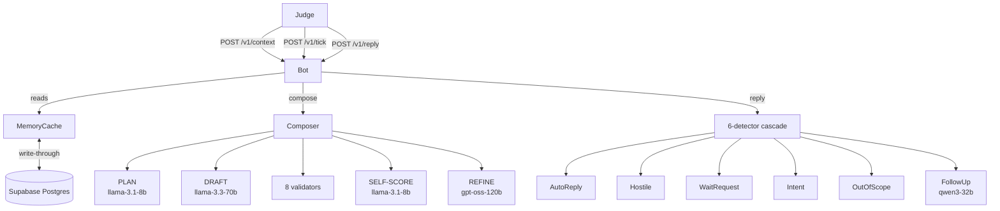

# Vera Bot — magicpin AI Challenge Submission

A merchant-engagement composer that grounds every output in the context it
receives. Built for the 5-dimension rubric, the 3-day live judging window,
and the fresh scenarios the judge will inject.

---

## Approach (3 bullets)

- **Multi-stage composer** — every message goes through `PLAN → DRAFT → VALIDATE → SELF-SCORE → REFINE → ASSEMBLE`. Each stage's failures fail-fast or trigger a re-DRAFT/refine; restraint is rewarded (`compose()` can return `None`).
- **Multi-model routing across 4 free Groq buckets** — `llama-3.3-70b-versatile` for DRAFT, `gpt-oss-120b` for REFINE (contrasting style), `llama-3.1-8b-instant` for PLAN/SELF-SCORE/CLASSIFY (cheap, abundant), `qwen3-32b` for REPLY. Combined headroom ≈ 32K TPM, 17K RPD. Automatic 429 fallback to a different bucket.
- **Adversarial-by-default** — `kind_default` is the *strongest* generic prompt (not a fallback) for novel kinds the judge invents; Pydantic `extra="allow"` on every context model; every dict access uses `.get()`; every LLM call is wrapped in try/except with conservative-default fallbacks; full Supabase write-through so 3-day live windows survive Render restarts.

---

## Architecture



---

## Model routing

| Stage | Model | Free RPM | Free TPM | Free RPD | Why |
|---|---|---:|---:|---:|---|
| DRAFT | `llama-3.3-70b-versatile` | 30 | 12K | 1,000 | Best free composition quality |
| REFINE | `openai/gpt-oss-120b` | 30 | 8K | 1,000 | Separate bucket; contrasting style |
| PLAN / SELF-SCORE / CLASSIFY | `llama-3.1-8b-instant` | 30 | 6K | **14,400** | Cheap, abundant |
| REPLY | `qwen/qwen3-32b` | **60** | 6K | 1,000 | Highest RPM bucket |

429 retry path: each purpose has a fallback bucket; on rate-limit the client transparently retries on the fallback model.

---

## 5 differentiators vs typical submission

1. **Self-score + refine loop** — bot judges its own output on the 5-dim rubric; if any dim < 7, runs a second pass on a contrasting model and ships the better of the two.
2. **Hand-tuned compulsion-lever priorities** — `social_proof` and `asking_the_merchant` get 1.5× weight (the two biggest misses in production Vera per challenge brief §10).
3. **Python fabrication guard** — every number / ₹ / % / date / page-ref / source-acronym in the body must trace to a context field (with percentage↔decimal equivalence).
4. **Language enforcement** — script + token detection for hi-en / te-en / kn-en / mr-en / ta-en mix; re-DRAFTs if customer's `language_pref` is ignored.
5. **Multi-turn state machine** — 6-detector cascade (auto-reply / hostile / wait / intent transition / out-of-scope / follow-up) with regex + LLM verify; auto-reply counter escalation (nudge → wait 4h → end); merchant-block on hostile reply.

---

## Tradeoffs

- **Single hand-tuned prompt for 2 kinds + 1 strong default** instead of 24 hand-tuned. The `kind_default` produces case-study-quality output for unseen kinds (verified on `competitor_opened`, `mystery_signal_invented_by_judge`). Investing in 22 more hand-tuned prompts is marginal vs. tuning the default.
- **Sequential dataset run** for `submission.jsonl` (vs parallel) — protects against Groq TPM bursts at the cost of ~3 minutes longer total time.
- **Render free + Supabase write-through** instead of a paid VM. Trade: cold-start risk during a 3-day window, mitigated by UptimeRobot 5-min ping + state rehydration on restart (<1s).

---

## What more context would help

- **Merchant Lifetime Value & churn risk** would let me prioritize which suppression-key to refresh sooner.
- **Per-merchant best-time-to-text** (from prior reply-latency data) — currently I cadence-guard with a flat 4h window.
- **Customer wedding-date / payment-date / reservation-date** as a separate trigger-payload field would help the wedding/recall framing be sharper.
- **Per-conversation sentiment trend** — to back off proactively when the merchant's tone drifts neutral, not just when they say "stop".

---

## Endpoints

| Method | Path | Purpose |
|---|---|---|
| GET | `/v1/healthz` | liveness + context counts |
| GET | `/v1/metadata` | team identity + model list |
| POST | `/v1/context` | versioned, idempotent context push (200/409) |
| POST | `/v1/tick` | proactive sends (≤20 actions, 25s deadline) |
| POST | `/v1/reply` | merchant/customer reply (send/wait/end) |
| GET | `/` | service status placeholder |

---

## Local self-test

```bash
cd submission
source .venv/Scripts/activate          # or .venv/bin/activate on Linux/Mac
uvicorn bot:app --host 0.0.0.0 --port 8080 --reload

# In another terminal:
python -m tests.test_phase_de   # composer e2e
python -m tests.test_phase_fg   # validators + self-score + refine
python -m tests.test_phase_h    # 6-detector reply cascade
python -m tests.test_phase_ij   # tick pipeline + adversarial
python submission_runner.py     # generate submission.jsonl
```

---

## Submission contents

- `bot.py` — FastAPI entrypoint; 5 endpoints
- `core/`, `state/`, `llm/`, `composer/`, `validators/`, `reply/`, `pipeline/` — production code
- `submission_runner.py` — produces `submission.jsonl` from canonical 30 pairs
- `submission.jsonl` — 30-line canonical output
- `conversation_handlers.py` — exports `respond(state, message)` for offline tiebreaker
- `tests/` — pytest + manual e2e scripts
- `sql/init.sql` — Supabase schema
- `.env.example` — env var template (real `.env` gitignored)
- `requirements.txt`, `pytest.ini`, `pyrightconfig.json`

Solo submission.
